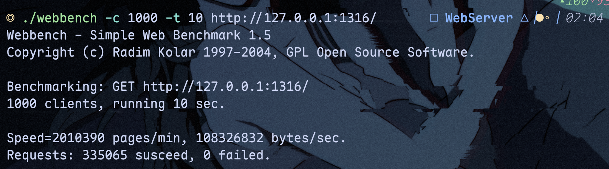

# 2025年6月6日

补充之前缺少的benchmark。

### 1.

使用webbench，fork出1000个客户端进行测试10s：

```bash
./webbench -c 1000 -t 10 http://127.0.0.1:1316/
```

开源常规实现：[WebServer](https://github.com/markparticle/WebServer)



本实现：  


可以看到出现了少量失败，但qps更高，提升了18.3%.

### 2. 高压力情况

```bash
./webbench -c 10000 -t 10 http://127.0.0.1:1316/
```

---

测试环境：
```txt
            .-:/++oooo++/:-.               horeb@horeb-ThinkBook-14-G6-AHP
        `:/oooooooooooooooooo/-`           -------------------------------
      -/oooooooooooooooooooo+ooo/-         OS: Ubuntu Cinnamon 24.04.2 LTS x86_
    .+oooooooooooooooooo+/-`.ooooo+.       Host: 21LF ThinkBook 14 G6+ AHP
   :oooooooooooo+//:://++:. .ooooooo:      Kernel: 6.8.0-60-generic
  /oooooooooo+o:`.----.``./+/oooooooo/     Uptime: 28 mins
 /ooooooooo+. +ooooooooo+:``/ooooooooo/    Packages: 3432 (dpkg), 235 (brew), 1
.ooooooooo: .+ooooooooooooo- -ooooooooo.   Shell: zsh 5.9
/oooooo/o+ .ooooooo:`+oo+ooo- :oooooooo/   Resolution: 3072x1920
ooo+:. .o: :ooooo:` .+/. ./o+:/ooooooooo   DE: Cinnamon 6.4.6
oooo/-`.o: :ooo/` `/+.     ./.:ooooooooo   WM: Mutter (Muffin)
/oooooo+o+``++. `:+-          /oooooooo/   WM Theme: Mint-Y-Dark-Grey (Mint-Y)
.ooooooooo/``  -+:`          :ooooooooo.   Theme: Mint-Y-Dark-Grey [GTK2/3]
 /ooooooooo+--+/`          .+ooooooooo/    Icons: Papirus-Dark [GTK2/3]
  /ooooooooooo+.`      `.:++:oooooooo/     Terminal: WezTerm
   :oooooooooooooo++++oo+-` .ooooooo:      CPU: AMD Ryzen 7 8845H w/ Radeon 780
    .+ooooooooooooooooooo+:..ooooo+.       GPU: AMD ATI 64:00.0 Phoenix3
      -/oooooooooooooooooooooooo/-         Memory: 6753MiB / 27863MiB
        `-/oooooooooooooooooo/:`
            .-:/++oooo++/:-.
```